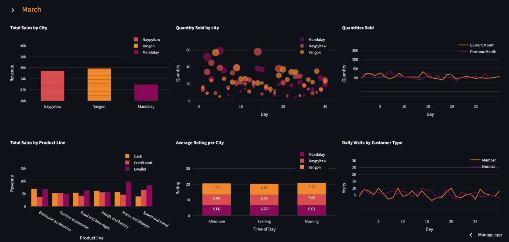

# Walmart Sales Dashboard



## Overview
This project provides a web-based dashboard for visualizing Walmart sales data using Streamlit, Plotly, and Pandas. It aims to provide interactive visualizations and insights into sales trends and product performance.

## Features
- Interactive web-based dashboard.
- Visualizations powered by Plotly for dynamic charts.
- Data manipulation and analysis using Pandas.

## Demo
Check out the live demo [here](https://walmart-sales-dashboard.streamlit.app/).

## Installation
1. Clone the repository:
   ```bash
   git clone https://github.com/its-saran/sales_dashboard.git
   cd sales_dashboard
   ```
   
2. Install dependencies from requirements.txt:

    ```bash
    pip install -r requirements.txt
    ```
   
## Usage
1. Ensure all dependencies are installed (see Installation above).
    Run the Streamlit web app:
    ```bash
    streamlit run app.py
    ```
2. Open your web browser and navigate to http://localhost:8501 (by default, Streamlit runs on port 8501) to view the dashboard.

## License
This project is licensed under the MIT License.